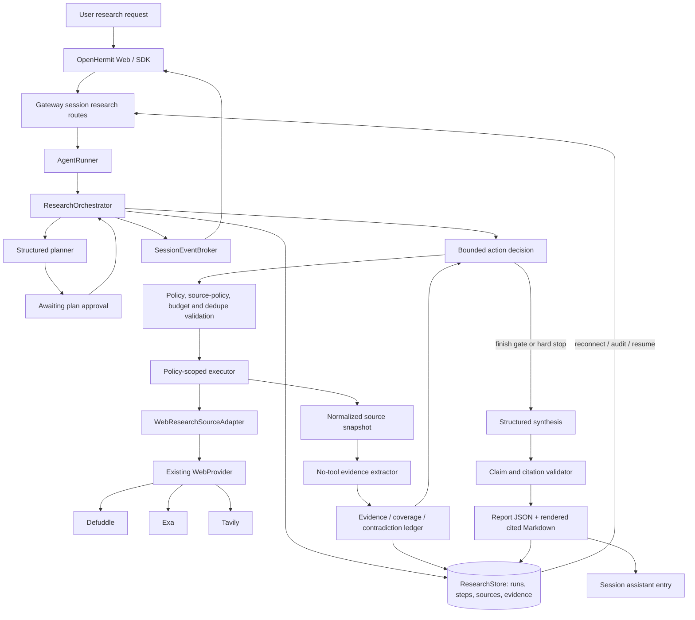

# OpenHermit Deep Research Engineering Plan

## 1. Executive Summary

Deep Research should be implemented as a durable, session-attached runtime workflow coordinated by a new `ResearchOrchestrator` owned by `AgentRunner`. It should not be a normal agent tool, separate application, permanent session mode, or multi-agent swarm.

The design follows the public Deep Research philosophy of multi-step investigation across web and private sources while preserving OpenHermit’s own architecture; it does not assume or reproduce proprietary internals. [Official OpenAI documentation](https://developers.openai.com/api/docs/models/o3-deep-research) publicly describes deep research as handling complex, multi-step research across the internet and user-provided data.

The MVP will provide:

- An LLM-generated, structured, editable research plan requiring explicit approval.
- A program-controlled iterative loop for query generation, search, source selection, reading, evidence extraction, contradiction/gap detection, and synthesis.
- Hard budgets and deterministic anti-loop stopping conditions.
- Durable runs, steps, normalized source snapshots, and evidence in PostgreSQL.
- Claims linked to evidence IDs, with citations rendered from validated source records.
- Existing OpenHermit policy-wrapped `web_search` and `web_fetch` capabilities.
- Live operational progress over existing session SSE/WebSocket transport.
- Pause, refinement, cancellation, manual retry, and manual restart recovery.
- A minimal React UI for plan review, progress, sources, and the cited report.

The MVP will not require a workflow engine, vector database, graph database, separate browsing stack, raw chain-of-thought storage, uploaded-file research, MCP research, sandbox analysis, full automatic crash recovery, or subagents.

---

## 2. Current OpenHermit Architecture Relevant to Deep Research

- `AgentRunner` is the in-process runtime owner. It manages sessions, per-session queues, model/tool configuration, access policies, approvals, MCP connections, context compaction, introspection, tool-result persistence, and session event publication.
- Gateway `AgentInstanceManager` lazily hydrates runners and evicts idle runners. PostgreSQL agent status is durable; the runner map is an in-memory cache.
- Each runner opens a `DbInternalStateStore`, exposing sessions, messages, memories, instructions, users, and schedules through one database pool.
- Sessions are durable in `sessions`; transcript/tool/system entries are append-only rows in `session_events`.
- `SessionEventBroker` is runner-local and live-only: it uses an in-memory 100-event backlog and resets its sequence after runner hydration.
- HTTP, SSE, and WebSocket session APIs are implemented in the Hono gateway. Existing authentication and session-participant checks are centralized there.
- Per-session execution is serialized through `RunnerSession.queue`. `Agent.abort()` and `/sessions/:id/interrupt` already support cancellation of active normal turns.
- Context compaction summarizes older transcript entries while retaining recent messages. It is transcript-oriented and does not maintain structured evidence or citations.
- Large tool results are written to `.openhermit/tool_results/` in the workspace, with only a preview retained in context. This is external working state, not durable internal provenance.
- Introspection demonstrates a useful internal-workflow precedent: a program-triggered model run, narrow tool list, persisted start/end events, explicit tool-call limit, and Langfuse trace.
- `WebProvider` abstracts search and fetch across Defuddle, Exa, and Tavily.
- Attachments already provide durable metadata and bytes, SSRF-safe URL ingestion, sandbox materialization, and PDF/DOCX/XLSX/notebook/image parsing.
- MCP tools are dynamically namespaced and policy-gated, but their results currently lose enough structured metadata that they are not yet reliable research provenance.
- Sandbox execution is already policy- and approval-aware through the normal tool layer.
- `apps/web` is a React 19/Vite chat interface with WebSocket reconnection, approvals, attachments, sanitized Markdown, and a stop control.

---

## 3. Existing Components We Can Reuse

| Component | Treatment | Deep Research use |
|---|---|---|
| Sessions, participants, authentication | Reuse unchanged | A research run belongs to a normal session and inherits its access boundary. |
| `AgentRunner` lifecycle | Extend | Expose research start/control/query methods and own the orchestrator without embedding its algorithm in the existing large file. |
| `InternalStateStore` | Extend | Add a typed `ResearchStore` on the same database/pool boundary. |
| `SessionEventBroker` | Reuse for live delivery | Publish typed research progress; do not treat its backlog as durable recovery state. |
| `session_events` | Reuse selectively | Store the initial user request, final assistant report, and terminal error; do not store every research action there. |
| Per-session queue and abort behavior | Extend | Prevent conflicting normal turns while research is actively executing and propagate research-specific abort signals. |
| Access-policy and approval wrapping | Reuse after refactor | Construct normal policy-wrapped tools, then expose only the research-approved subset to the orchestrator. |
| `WebProvider` | Extend, not replace | Add reliable filters and typed acquisition metadata while keeping Defuddle/Exa/Tavily implementations. |
| Attachment SSRF protection | Extract and reuse | Build a common safe-fetch primitive for direct web acquisition; attachment callers retain HTTPS-only behavior. |
| Tool-result persistence | Reuse for normal turns only | Research provenance goes to research tables because workspace previews cannot support citation auditability. |
| Context compaction | Reuse unchanged for chat | Research model contexts are rebuilt from the durable evidence ledger and therefore do not depend on transcript compaction. |
| Langfuse and Prometheus | Extend | Add one trace per research run and low-cardinality research metrics. |
| Uploaded document parsing | Reuse later | Phase 4 attachment-source adapter; Phase 3 may reuse its PDF extraction for web PDFs. |
| MCP client and sandbox backends | Reuse later | Add source-specific adapters without coupling the core workflow to web pages. |
| React chat shell and WebSocket client | Extend | Add a lazy-loaded research workspace using the same session subscription. |

No core component should be replaced. The only existing execution path that should be replaced is Defuddle’s unrestricted direct target fetch; it should use the shared SSRF-safe fetch primitive.

---

## 4. Gaps in the Current System

### Workflow gaps

- `AgentRunner` permits an open-ended model/tool loop bounded only by 15 consecutive tool failures. It does not enforce research iterations, searches, fetches, tokens, elapsed time, or information-gain limits.
- Sessions have no plan-approval, budget, evidence, source, checkpoint, or resumable workflow model.
- `session_events` are transcript records, not idempotent workflow steps.
- The live broker cannot reconstruct a run after runner or gateway restart.
- Context compaction cannot preserve exact claim-to-evidence provenance.

### Web gaps

| Capability | Existing limitation | Required change |
|---|---|---|
| Domain restriction | Provider contract contains include/exclude fields, but `web_search` does not expose them and Defuddle ignores them | Expose tool parameters and implement strict provider behavior. |
| Preferred domains | No concept | Research adapter schedules preferred-domain searches before wider searches. |
| Search ranking | Optional provider-specific scores only | Keep provider rank separate; add plan relevance and quality dimensions in the research layer. |
| Pagination/deeper retrieval | None | Phase 3 cursor/page extension. MVP uses adaptive new queries. |
| Publication filtering | Inconsistent date output and no filters | Normalize dates in MVP; add provider filters in Phase 3. |
| Concurrency | Only Defuddle’s `full` mode fetches results concurrently | Orchestrator owns bounded search/fetch concurrency. |
| URL deduplication | Exact URL checks only inside one Defuddle result page | Add canonical normalization, canonical hash, and content hash. |
| Metadata | Mostly untyped `metadata` | Add typed canonical URL, MIME type, status, author, publisher, dates, and retrieval time. |
| Snapshots | None | Persist a bounded normalized-text snapshot and content hash. |
| Evidence extraction | Tool returns page text | Add exact excerpt verification and stable locators. |
| Retry/timeout behavior | Provider-specific or absent | Add timeouts, retry classification, jitter, and `Retry-After` handling. |
| SSRF | Direct Defuddle fetch only checks URL scheme | Route direct target fetches through shared SSRF and redirect validation. |
| PDF | No reliable web-PDF extraction | Transparent unsupported state in MVP; page-aware support in Phase 3. |

### Provenance gaps

- A tool URL is not evidence.
- Workspace tool-result files are not guaranteed to survive, are not indexed by claim, and may contain only previews in persisted history.
- MCP result details are stringified and lack a stable server/tool/call/result-hash provenance chain.
- No server validation currently prevents a model from inventing citation relationships.

### Why new abstractions are necessary

- `ResearchRun` is necessary because a session lacks workflow phase, budget, plan version, checkpoint, and recovery semantics.
- `ResearchStep` is necessary because `session_events` cannot provide action idempotency, retries, counters, or a durable execution cursor.
- `ResearchSource` is necessary because tool results do not normalize source identity, metadata, snapshots, or duplicates.
- `ResearchEvidence` is necessary because memory and transcript text cannot preserve exact excerpts and locators.
- A `ResearchOrchestrator` is necessary because a normal `Agent` loop leaves control and stopping entirely to the model.
- Separate `ResearchTask`, `ResearchClaim`, `ResearchCitation`, and `ResearchArtifact` tables are not necessary for the MVP.

---

## 5. Target User Experience

1. The user selects “Deep Research” in the existing composer and supplies the objective, desired depth, and source controls.
2. OpenHermit immediately creates a durable run and shows “Planning research.”
3. The planner produces a structured plan containing scope, assumptions, subquestions, source strategy, deliverable, and completion criteria.
4. The user edits or approves the plan.
5. The UI shows a concise timeline such as:

   - Searching official filings for revenue data
   - Reviewing eight candidate sources
   - Reading the 2025 annual report
   - Comparing conflicting market estimates
   - Looking for an independent methodology source
   - Preparing the final report

6. The user may pause, cancel, or submit a refinement. A refinement pauses at a safe boundary, revises the plan, and returns it for confirmation.
7. The final report appears as a normal assistant entry plus a richer research report view.
8. Each factual statement has clickable citations backed by stored evidence excerpts and source metadata.
9. Reopening the session reloads the run, steps, sources, evidence, and report from PostgreSQL rather than from the live-event backlog.

One nonterminal research run is allowed per session. Ordinary chat may continue while the run is awaiting plan approval or paused, but active planning, research, and synthesis reject conflicting normal turns with `409 research_run_active`.

---

## 6. Proposed Deep Research Architecture

### Core components

```ts
interface ResearchOrchestrator {
  createRun(input: CreateResearchRunInput): Promise<ResearchRun>;
  approvePlan(runId: string, expectedVersion: number): Promise<void>;
  updatePlan(runId: string, update: ResearchPlanUpdate): Promise<ResearchRun>;
  pause(runId: string): Promise<void>;
  refine(runId: string, input: ResearchRefinement): Promise<void>;
  resume(runId: string): Promise<void>;
  cancel(runId: string): Promise<void>;
  retry(runId: string): Promise<void>;
}

interface ResearchSourceAdapter {
  readonly kind: ResearchSourceKind;
  discover(
    request: ResearchDiscoveryRequest,
    context: ResearchExecutionContext,
  ): Promise<ResearchSourceCandidate[]>;
  acquire(
    candidate: ResearchSourceCandidate,
    context: ResearchExecutionContext,
  ): Promise<AcquiredResearchSource>;
}
```

- The MVP implements `WebResearchSourceAdapter`, delegating to the configured `WebProvider`.
- Later adapters implement attachments, MCP, structured APIs, and sandbox-produced artifacts.
- Model calls are bounded, stateless phase calls: planner, action decider, per-source extractor, and synthesizer.
- The model never directly controls an unrestricted tool loop. It emits validated JSON actions; the orchestrator decides whether they are allowed and affordable.
- The orchestrator executes only policy-wrapped tools assembled through `AgentRunner`.
- A typed evidence ledger is the working memory for research.
- The final citation renderer resolves evidence IDs server-side and emits report citations.

### Key architectural decisions

| Question | Decision | Alternatives and tradeoffs | Recommendation |
|---|---|---|---|
| 1. Tool, session mode, workflow, or primitive? | Durable workflow resource attached to a normal session | A tool hides lifecycle and approvals; a permanent session mode couples all chat behavior; a separate app duplicates auth/session/runtime | Use nested session research-run APIs and the existing session transport. |
| 2. Where does the loop live? | Dedicated orchestrator owned by `AgentRunner` | Putting it directly in `agent-runner.ts` enlarges an already central file; a gateway service would bypass runtime policy/model/tool ownership | Keep the algorithm under `apps/agent/src/research/`; `AgentRunner` delegates. |
| 3. How much state is durable? | Plan, status, budgets, usage, steps, sources, snapshots, evidence, checkpoint, report | Transcript-only state cannot resume or audit; persisting every model token is excessive | Persist semantic workflow state, not chain-of-thought or raw streams. |
| 4. How does progress map to sessions? | Typed live session events plus durable `research_steps` | Persisting all progress in `session_events` pollutes chat; broker-only progress disappears | Use broker for immediacy and research tables for replay. |
| 5. How do citations survive compaction? | Stable run/source/evidence IDs in PostgreSQL | Relying on transcript URLs allows citation invention and loss during compaction | Synthesis reads evidence cards; server resolves citations. |
| 6. How do web tools evolve? | Extend the existing provider/tool contract | A new browser stack duplicates providers; leaving tools unchanged cannot enforce source controls or provenance | Add filters, metadata, safe acquisition, retry, and normalization incrementally. |
| 7. Concurrent searches? | Yes, maximum two independent searches | Sequential execution is slow; unrestricted parallelism spends budget unpredictably | Reserve budget before `Promise.allSettled` and persist each action separately. |
| 8. Concurrent page fetches? | Yes, maximum three, with one per domain | Sequential reading is unnecessarily slow; high concurrency increases rate limits and duplicate work | Use three global and one per-domain semaphore. |
| 9. Code execution? | Not in MVP; later explicit, policy-gated analysis action | Always exposing exec increases injection and cost risk; never exposing it limits data analysis | Enable only when the plan requires computation and the user/policy permits it. |
| 10. MCP sources? | Phase 4, explicitly selected and read-only | Treating arbitrary MCP tools as sources loses provenance and may permit writes | Require server/tool allowlists and store call/result hashes. |
| 11. Plan approval? | Required in MVP | Auto-start is convenient for automation but weakens control before expensive execution | Implement review/edit/approve first; add explicit auto-start later. |
| 12. What stops the loop? | Finish gate, hard budget, diminishing returns, cancellation, or systemic failure | `while (modelWantsMore)` is unbounded; fixed iteration count alone may stop too early | Combine deterministic hard limits with model-visible coverage criteria. |
| 13. Repeated searches? | Canonical query fingerprints, semantic near-duplicate checks, and zero-gain streaks | Exact string comparison misses reformulations; embeddings add unnecessary MVP infrastructure | Normalize tokens/domains/date scope and let the action validator reject equivalent queries. |
| 14. Prompt injection? | Raw source content is untrusted data shown only to a no-tool extractor | Passing pages to the main agent allows instructions to influence tools | Separate acquisition, extraction, decision, and execution contexts. |
| 15. Resume behavior? | Manual resume from a durable action checkpoint in MVP | Automatic leasing is more robust but substantially increases duplicate-execution complexity | Pause stale active runs after restart; implement leases in Phase 2. |
| 16. Multi-agent design? | Not justified for MVP | Parallel researchers may improve breadth but increase coordination, deduplication, cost, and citation complexity | Revisit only after benchmarks show independent branches outperform bounded action concurrency. |

---

## 7. Research Lifecycle / State Machine

```text
created
  → planning
  → awaiting_plan_approval
  → queued
  → researching
  → synthesizing
  → completed

Any nonterminal state:
  → paused
  → cancelled

planning / researching / synthesizing:
  → failed

researching / synthesizing:
  → budget_exhausted

paused:
  → queued or synthesizing, using resume_phase

failed:
  → planning / queued / synthesizing through explicit retry

budget_exhausted:
  → queued after explicit budget increase
```

### Transition rules

- `created → planning`: durable row exists before the planner call begins.
- `planning → awaiting_plan_approval`: planner JSON validates and is persisted.
- `awaiting_plan_approval → queued`: version-matched user approval.
- `queued → researching`: per-agent research semaphore acquired.
- `researching → synthesizing`: finish gate passes or a hard stop requires a partial report.
- `synthesizing → completed`: full report created and validated.
- `synthesizing → budget_exhausted`: partial report created because research stopped before coverage.
- `pause`: set `pause_requested`, abort the current bounded operation when supported, finish its checkpoint, and store `resume_phase`.
- `refine`: perform pause semantics, invalidate unstarted actions, revise the plan/source policy, increment the plan version, and return to `awaiting_plan_approval`.
- `cancel`: abort active work, mark pending steps cancelled, and enter terminal `cancelled`.
- `failed`: retain the last completed checkpoint and a sanitized error; retry resumes the recorded phase.
- `completed` and `cancelled` are terminal. A refinement after completion creates a new run referencing the prior run, rather than mutating the completed report.
- `budget_exhausted` and `failed` are stopped but resumable only by explicit user action.

### Concurrency and correctness

- One nonterminal run per session.
- Default one executing research run per agent; additional approved runs remain `queued`.
- State changes use compare-and-set semantics against the expected current status and plan version.
- Every external action gets a durable step and deterministic dedupe key before execution.
- Search-result insertion and step completion occur in one transaction.
- Evidence insertion is idempotent by evidence hash.
- A graceful runner shutdown pauses active runs. On hydration after an unclean restart, stale `planning`, `queued`, `researching`, or `synthesizing` rows become `paused` with reason `runtime_restart`.

---

## 8. Planning Model

```ts
interface ResearchPlan {
  schemaVersion: 1;
  objective: string;
  audience?: string;
  assumptions: string[];
  scope: {
    includedTopics: string[];
    excludedTopics: string[];
    timeframe?: { from?: string; to?: string };
    geographies?: string[];
  };
  questions: Array<{
    id: string;
    question: string;
    priority: 'required' | 'supporting';
    rationale: string;
    preferredSourceKinds?: ResearchSourceClass[];
    requiresPrimarySource?: boolean;
  }>;
  deliverable: {
    format: 'report';
    requestedSections: string[];
    decisionOrOutcome?: string;
  };
  completionCriteria: {
    requiredQuestionIds: string[];
    unresolvedContradictionsAllowed: boolean;
  };
}

interface ResearchSourcePolicy {
  web: {
    mode: 'full_web' | 'only_domains' | 'prefer_domains';
    domains: string[];
    excludedDomains: string[];
  };
  attachmentIds: string[]; // accepted by contract, activated in Phase 4
  mcpServerIds: string[];  // accepted by contract, activated in Phase 4
  allowCodeAnalysis: boolean;
}

type ResearchDepth = 'quick' | 'standard' | 'thorough';
```

Planning behavior:

- The planner receives the objective, source policy, depth, budget summary, and relevant user-provided constraints.
- It receives no tools and no retrieved web content.
- It emits JSON parsed and validated with Zod.
- Provider-native structured outputs may be used when available, but JSON-plus-Zod with one repair attempt remains the cross-provider contract.
- The planner may clarify assumptions in the plan; it does not silently broaden source access or budget.
- The plan is persisted as a versioned object and shown in human-readable form.
- Plan edits require `expectedVersion`; stale edits return `409`.
- Source policy and runtime budget are separate validated run fields shown beside the plan. The planner cannot loosen either.
- `ResearchTask` rows are unnecessary: plan questions plus durable steps provide enough structure for the MVP.

---

## 9. Research Execution Loop

### Algorithm

```text
load run, validated plan, working state, usage, and controls

while run is researching:
  1. Check cancellation, pause, elapsed time, and reserved synthesis budget.
  2. Build a compact research brief:
       - question coverage
       - evidence summaries
       - source-quality mix
       - contradictions
       - failed/blocked sources
       - recent query fingerprints
       - remaining budget
  3. Ask the decision model for 1–3 actions:
       - search
       - read_source
       - finish
       - later: analyze_data / read_attachment / call_mcp
  4. Validate every action:
       - schema and referenced IDs
       - source policy
       - access policy
       - budget reservation
       - duplicate query/source checks
       - concurrency limits
  5. Persist pending steps.
  6. Execute approved actions with bounded concurrency.
  7. For each acquired source:
       - normalize and hash content
       - classify duplicate/source quality
       - run no-tool evidence extraction
       - verify excerpts against the stored snapshot
       - update question coverage and contradiction candidates
  8. Persist state and usage.
  9. Evaluate finish gate and information gain.
```

### Action contract

```ts
type ResearchAction =
  | {
      type: 'search';
      questionIds: string[];
      query: string;
      rationale: string;
    }
  | {
      type: 'read_source';
      sourceId: string;
      questionIds: string[];
      rationale: string;
    }
  | {
      type: 'finish';
      rationale: string;
    };
```

The `rationale` is a concise operational explanation, not hidden reasoning, and is safe to display as progress.

### Hard budgets

| Limit | Quick | Standard default | Thorough |
|---|---:|---:|---:|
| Research iterations | 6 | 12 | 20 |
| Searches | 8 | 18 | 32 |
| Fetched sources | 10 | 24 | 45 |
| Total model calls | 22 | 40 | 72 |
| Execution elapsed time | 10 min | 20 min | 45 min |
| Normalized bytes per source | 200 KB | 200 KB | 200 KB |
| Normalized bytes per run | 1.5 MB | 3 MB | 6 MB |
| Input tokens | 250k | 500k | 900k |
| Output tokens | 40k | 80k | 120k |

- Reserve one model call and a configurable token allowance for synthesis before scheduling research actions.
- Search/fetch/model-call/token/time/source-byte limits are hard.
- Dollar cost is recorded when provider usage reports it. A requested hard dollar cap is accepted only when every selected model/provider can report enforceable cost; otherwise the API rejects that cap rather than pretending to enforce it.
- Retries count in retry telemetry and elapsed time. A logical action counts once against its search/fetch budget; model repair calls count as model calls.

### Model-visible soft goals

- Cover every required subquestion.
- Prefer primary or official evidence when the plan requests it.
- Support central factual findings with either one primary/official source or two independent source clusters.
- Attempt at least one targeted follow-up for every central contradiction.
- State missing data instead of filling gaps from model memory.
- Stop when further searches are unlikely to materially improve the report.

### Deterministic stopping conditions

Research moves to synthesis when:

- The decision model requests `finish` and the finish gate passes; or
- Any hard budget is reached; or
- Three consecutive iterations add no new relevant evidence, source class, question coverage, or contradiction resolution; or
- Equivalent searches are repeatedly proposed and no alternative action remains; or
- The user pauses/cancels; or
- Three consecutive systemic provider failures make continued research infeasible.

If coverage passes, the result is `completed`. If a safety/budget/diminishing-return stop occurs before coverage, synthesize a clearly partial report and enter `budget_exhausted`.

---

## 10. Source and Evidence Model

### Definitions

- **Source:** An acquired or candidate information object: web page, PDF, uploaded file, MCP result, structured API result, or analysis artifact.
- **Evidence:** A bounded, verifiable excerpt or data point from one source, with a stable locator and the questions it addresses.
- **Claim:** A factual statement in the final report, stored inside `report_json`, referencing evidence IDs.
- **Citation:** The rendered claim-to-evidence-to-source link. It is derived and validated, not independently authored by the model.

### Source record

```ts
interface ResearchSource {
  sourceId: string;
  runId: string;
  kind: 'web' | 'attachment' | 'mcp' | 'api' | 'analysis';
  status: 'candidate' | 'fetched' | 'blocked' | 'failed' | 'unsupported' | 'duplicate';
  url?: string;
  canonicalUrl?: string;
  title?: string;
  publisher?: string;
  domain?: string;
  author?: string;
  publishedAt?: string;
  retrievedAt?: string;
  mimeType?: string;
  sourceClass: ResearchSourceClass;
  discoveredByStepId: string;
  contentHash?: string;
  snapshotText?: string;
  contentBytes?: number;
  truncated: boolean;
  duplicateOfSourceId?: string;
  quality: SourceQualityAssessment;
  metadata: Record<string, unknown>;
}
```

### Evidence record

```ts
interface ResearchEvidence {
  evidenceId: string;
  runId: string;
  sourceId: string;
  extractionStepId: string;
  questionIds: string[];
  excerpt: string;
  locator: ResearchLocator;
  claimKey?: string;
  stance: 'supports' | 'contradicts' | 'context';
  normalizedValue?: string;
  scope?: {
    asOf?: string;
    geography?: string;
    population?: string;
    definition?: string;
    methodology?: string;
  };
  relevanceBasisPoints: number;
  confidenceBasisPoints: number;
  evidenceHash: string;
}
```

### Exactness and deduplication

- Evidence excerpts are capped, defaulting to 1,000 characters.
- For normalized text snapshots, the server verifies that a whitespace-normalized excerpt exists and computes offsets. Unmatched excerpts are rejected or explicitly marked unverifiable; they cannot support a final claim.
- URLs are normalized by scheme/host casing, default-port removal, fragment removal, tracking-parameter removal, path normalization, and canonical-link preference.
- Canonical URL hash prevents repeat acquisition within a run.
- Content hash detects mirrors and syndicated copies.
- Duplicate sources remain visible for audit but do not count as independent corroboration.
- Publisher/domain/syndication clusters determine independence.

### Source quality

Use labels and dimensions, not a universal truth score:

```ts
type ResearchSourceClass =
  | 'primary'
  | 'official'
  | 'academic'
  | 'reputable_secondary'
  | 'aggregator'
  | 'user_generated'
  | 'unknown';

interface SourceQualityAssessment {
  sourceClass: ResearchSourceClass;
  authority: 'high' | 'medium' | 'low' | 'unknown';
  proximityToClaim: 'direct' | 'reported' | 'derived' | 'unknown';
  recency: 'current' | 'dated' | 'unknown';
  methodologyTransparency: 'clear' | 'partial' | 'absent' | 'unknown';
  independenceCluster: string;
  notes: string[];
}
```

Trusted domains affect retrieval priority, not an automatic truth rating.

### Contradictions

- Evidence extraction emits a normalized `claimKey`, stance, value, date, geography, definition, and methodology where applicable.
- Evidence with matching claim keys and incompatible stances/values becomes a contradiction candidate.
- The decision model receives both evidence records and their scope differences.
- It may resolve the conflict as a date, definition, geography, methodology, or genuinely conflicting-source issue.
- At least one targeted follow-up is required for a central contradiction.
- Unresolved conflicts are shown explicitly with citations to both sides. Values are never silently averaged.

---

## 11. Citation Architecture

### Acquisition-to-report flow

```text
search step
  → source candidate
  → acquired normalized snapshot + hash
  → verified evidence excerpt + locator
  → report claim references evidence IDs
  → server validates IDs and source ownership
  → renderer emits numbered citations and source panel
```

### Report contract

```ts
interface ResearchReport {
  schemaVersion: 1;
  title: string;
  executiveSummary: ResearchStatement[];
  sections: Array<{
    id: string;
    title: string;
    statements: ResearchStatement[];
  }>;
  contradictions: Array<{
    summary: string;
    evidenceIds: string[];
    resolution: string | null;
  }>;
  gaps: Array<{
    questionId?: string;
    description: string;
  }>;
  methodology: string[];
}

interface ResearchStatement {
  claimId: string;
  kind: 'finding' | 'analysis' | 'caveat';
  text: string;
  evidenceIds: string[];
  confidence: 'high' | 'medium' | 'low';
}
```

Rules:

- Every `finding` requires at least one valid evidence ID.
- Evidence must belong to the same run.
- The synthesis model never supplies citation URLs.
- The server resolves `evidenceId → sourceId → source metadata`.
- Unsupported findings trigger one synthesis repair attempt. If still unsupported, they are converted to labeled caveats rather than silently emitted.
- Numbered citations are deduplicated by source plus locator.
- The final Markdown assistant entry is rendered from the validated report object.
- The durable `report_json` remains authoritative even if the chat transcript is later compacted.

### Locator types

- HTML: snapshot hash, character offsets, nearest heading, canonical URL.
- PDF: file hash and page number; added in Phase 3/4.
- Uploaded file: attachment ID, SHA-256, page/sheet/cell/line.
- MCP: server ID, tool name, sanitized argument hash, call ID, result hash, JSON pointer.
- Structured API: endpoint identity, sanitized request hash, result hash, JSON pointer.
- Analysis: input artifact hashes, script/command hash, output artifact ID, line/table/cell locator.

---

## 12. Context Management

Research should not repeatedly inject all fetched pages into a growing conversation.

```text
bounded acquired content
  → normalized source snapshot
  → per-source no-tool evidence extraction
  → durable evidence cards
  → compact coverage/contradiction ledger
  → final synthesis from evidence cards
```

- Keep verbatim:
  - Bounded normalized source snapshot.
  - Verified evidence excerpts.
  - Final report object.
- Summarize:
  - Search-result snippets.
  - Source-quality notes.
  - Question coverage.
  - Contradictions, gaps, and rejected actions.
- Persist:
  - Plan, source policy, budget/usage, typed working state, steps, sources, evidence, and report.
- Reconstruct:
  - Source snapshots are tied to content hashes and retrieval timestamps.
  - Every report citation resolves through durable IDs.
- Model contexts:
  - Decision calls receive plan, ledger, recent actions, gaps, and budget—not raw pages.
  - Extraction calls receive one bounded source, relevant questions, and an untrusted-content envelope, with no tools.
  - Synthesis receives evidence cards and source metadata, not complete pages.
- Existing chat compaction remains unchanged. The report survives it through `research_runs.report_json`.
- `.openhermit/tool_results` remains a convenience for normal tool calls and is not used as the research evidence store.

---

## 13. Progress / Streaming / Interruptibility

### Protocol events

Add typed `OutboundEventBody` variants:

```ts
type ResearchProgressPhase =
  | 'planning'
  | 'plan_ready'
  | 'queued'
  | 'searching'
  | 'reviewing_sources'
  | 'reading_source'
  | 'extracting_evidence'
  | 'comparing_evidence'
  | 'synthesizing'
  | 'paused'
  | 'completed'
  | 'failed';

type ResearchProgressEvent = {
  type: 'research_progress';
  sessionId: string;
  runId: string;
  stepId?: string;
  phase: ResearchProgressPhase;
  status: ResearchRunStatus;
  message: string;
  counts?: {
    searches: number;
    fetchedSources: number;
    evidenceItems: number;
    coveredQuestions: number;
  };
};

type ResearchPlanReadyEvent = {
  type: 'research_plan_ready';
  sessionId: string;
  runId: string;
  planVersion: number;
};

type ResearchSourceUpdateEvent = {
  type: 'research_source_update';
  sessionId: string;
  runId: string;
  sourceId: string;
  status: ResearchSource['status'];
  title?: string;
  domain?: string;
};

type ResearchReportReadyEvent = {
  type: 'research_report_ready';
  sessionId: string;
  runId: string;
  terminalStatus: 'completed' | 'budget_exhausted';
};
```

- Events expose operational state only, never chain-of-thought.
- `stepId` lets the UI deduplicate live events against durable timeline rows.
- On reconnect, the client first reloads run/steps/sources, then subscribes to live session events.
- The existing broker remains a transient optimization.

### Control semantics

- **Pause/Stop:** set a durable flag, abort the current bounded operation, checkpoint, enter `paused`.
- **Cancel:** terminal stop, no automatic synthesis.
- **Refine:** pause, store the user instruction as a refinement step, revise the plan/source policy, invalidate unstarted incompatible actions, and return to plan approval.
- **Resume:** validate source policy and remaining budget, then queue from `resume_phase`.
- **Retry:** retry only the failed phase.
- Previously collected evidence remains for audit. Evidence excluded by a revised scope is marked out-of-scope and omitted from synthesis rather than deleted.

---

## 14. Security and Prompt-Injection Defense

### Trust boundaries

- User instructions and system policy are trusted according to existing session/auth rules.
- Search snippets, pages, PDFs, MCP results, files, and command outputs are untrusted data.
- Retrieved content never becomes a system message.
- Page content cannot directly request tool calls or alter the plan.

### Concrete mitigations

1. Extract attachment SSRF/DNS/redirect logic into a shared safe-fetch module.
2. Block loopback, private, link-local, metadata, multicast, and DNS-rebinding targets.
3. Validate every redirect target and pin validated DNS resolution.
4. Reject embedded credentials in URLs and never send agent secrets or arbitrary cookies.
5. Enforce response timeout, MIME checks, compressed/decompressed size limits, and redirect limits.
6. Wrap content with source ID and explicit untrusted-data delimiters.
7. Give the source extractor no tools and only the relevant research questions.
8. Permit the extractor to emit evidence records, never new executable actions.
9. Validate all decision-model actions against source policy, budget, known IDs, and access policy.
10. Execute search/fetch through the same policy-wrapped tool path as normal agent tools.
11. Do not use current `createConfiguredAgent({ tools })` semantics for research user capabilities because explicit tools currently bypass policy filtering.
12. Refactor tool construction into:
    - policy-scoped user capabilities;
    - separately identified trusted internal tools.
13. Sanitize progress messages, provider errors, source titles, and report Markdown before UI rendering.
14. Keep MCP research read-only and explicitly allowlisted in Phase 4.
15. Keep sandbox execution disabled in the MVP; later executions retain normal approval requirements.
16. Never bypass paywalls, authentication boundaries, provider terms, or robots restrictions.

### Required adversarial assertions

- “Ignore previous instructions” in a page is stored only as source text.
- A page cannot cause a fetch to an arbitrary internal URL.
- A page cannot trigger MCP, exec, file writes, or secret expansion.
- A malicious source cannot alter plan/source controls.
- Citation links cannot use non-HTTP(S) schemes.
- Langfuse does not receive raw private-source content by default.

---

## 15. Persistence and Recovery

### MVP guarantees

| Event | Guarantee |
|---|---|
| Browser disconnect | Research continues; UI reconstructs from run/steps/sources. |
| WebSocket reconnect | Durable reload followed by normal session subscription. |
| Runner LRU eviction | Prevented while planning, researching, or synthesizing through a busy fence. |
| Graceful gateway shutdown | Current action aborted, checkpoint committed, run paused. |
| Abrupt process/gateway restart | Stale active run reconciled to `paused` on runner hydration; manual resume. |
| Temporary provider failure | Up to three classified retries, then alternative source/action or failure checkpoint. |
| Synthesis provider failure | Run becomes `failed` with `resume_phase = synthesizing`; evidence remains reusable. |

### Checkpoint protocol

- Insert step as `pending` before execution.
- Update to `running` with attempt number.
- Commit result rows and mark step `completed` transactionally.
- On interruption, mark the step `interrupted`.
- Search retry uses the same dedupe key and does not duplicate source rows.
- Fetch retry overwrites only if no valid snapshot exists.
- Evidence insertion is unique by run/evidence hash.
- Synthesis may be rerun entirely because it reads immutable evidence IDs.

### Production hardening

Phase 2 adds:

- `lease_owner`, `lease_expires_at`, and `heartbeat_at`.
- Atomic run claiming.
- Automatic resume after restart.
- Orphan-step reconciliation.
- Multi-gateway safety.
- Operator-configurable retention and cleanup jobs.

---

## 16. API / Protocol Changes

### HTTP routes

All routes remain nested under existing agent/session resources:

```text
POST   /api/agents/:agentId/sessions/:sessionId/research-runs
GET    /api/agents/:agentId/sessions/:sessionId/research-runs
GET    /api/agents/:agentId/sessions/:sessionId/research-runs/:runId
PATCH  /api/agents/:agentId/sessions/:sessionId/research-runs/:runId/plan
POST   /api/agents/:agentId/sessions/:sessionId/research-runs/:runId/actions
GET    /api/agents/:agentId/sessions/:sessionId/research-runs/:runId/steps
GET    /api/agents/:agentId/sessions/:sessionId/research-runs/:runId/sources
GET    /api/agents/:agentId/sessions/:sessionId/research-runs/:runId/sources/:sourceId
```

No top-level `/deep-research` route is needed.

### Request types

```ts
interface CreateResearchRunRequest {
  clientRequestId?: string;
  objective: string;
  depth?: ResearchDepth;
  sourcePolicy?: Partial<ResearchSourcePolicy>;
}

interface UpdateResearchPlanRequest {
  expectedVersion: number;
  plan: ResearchPlan;
  sourcePolicy?: ResearchSourcePolicy;
}

type ResearchRunActionRequest =
  | { action: 'approve_plan'; expectedPlanVersion: number }
  | { action: 'pause' }
  | { action: 'resume' }
  | { action: 'cancel' }
  | { action: 'refine'; instruction: string }
  | { action: 'retry' }
  | {
      action: 'increase_budget';
      limits: Partial<ResearchBudgetLimits>;
    };
```

- Start returns `202` with the durable run in `planning`.
- `clientRequestId` makes start idempotent within the session.
- Control endpoints return the latest run representation.
- Source details expose metadata and evidence excerpts; full snapshots are owner/debug-only and not part of the MVP public response.
- Existing session-participant and namespace checks apply to every route.

### WebSocket methods

Add parity methods:

```text
research.start
research.list
research.get
research.plan.update
research.action
research.steps
research.sources
```

Streaming remains through `session.subscribe`; there is no second socket or SSE channel.

### SDK

Add typed HTTP and WebSocket methods using protocol types. Preserve existing session APIs unchanged.

---

## 17. UI Changes

### MVP UI

- Add a “Deep Research” composer option.
- Add depth selection and simple source controls:
  - Full web.
  - Only these domains.
  - Prefer these domains but allow the web.
  - Excluded domains.
- Render an inline `ResearchPlanEditor` with:
  - Objective.
  - Scope and exclusions.
  - Assumptions.
  - Timeframe.
  - Subquestions.
  - Deliverable.
  - Source policy.
  - Budget/depth summary.
- Add Approve, Save changes, Pause, Refine, Resume, and Cancel actions.
- Add a progress timeline backed by durable steps.
- Add a source panel showing fetched/blocked/duplicate states, metadata, quality labels, and evidence excerpts.
- Render the structured report with clickable citations and unresolved contradictions/gaps.
- Continue sanitizing Markdown and external URLs.
- Lazy-load the research workspace so ordinary chat does not pay its bundle cost.

### Later UX improvements

- Full-screen report mode and table of contents.
- Markdown/PDF/DOCX export.
- Source comparison view.
- Visual question-coverage map.
- Inline contradiction resolution.
- Uploaded-file and MCP source picker.
- Per-domain/source budget visualization.
- Auto-start for trusted automation.
- Starting a follow-up run from selected prior evidence.

---

## 18. Database Changes

Add four tables to `packages/store/src/schema.ts`.

### `research_runs`

Key columns:

- `run_id` text primary key.
- `agent_id`, `session_id`, `requested_by_user_id`.
- `client_request_id`.
- `status`, `resume_phase`, `terminal_reason`.
- `objective`.
- `plan_json`, `plan_version`.
- `source_policy_json`.
- `budget_json`, `usage_json`.
- `working_state_json` with explicit `schemaVersion`.
- `report_json`.
- `pause_requested`, `cancel_requested`.
- `last_error`.
- `created_at`, `updated_at`, `started_at`, `completed_at`.

Indexes:

- `(agent_id, session_id, created_at)`.
- `(agent_id, status, updated_at)`.
- Partial unique `(agent_id, session_id, client_request_id)` where non-null.
- Partial unique enforcing one nonterminal run per session.

### `research_steps`

Key columns:

- `step_id` text primary key.
- `run_id`, `agent_id`.
- `iteration`, `attempt`.
- `kind`, `status`.
- `dedupe_key`.
- `question_ids` JSONB.
- `input_json`, `output_json`, `usage_json`.
- `summary`, `error`.
- `created_at`, `started_at`, `completed_at`.

Indexes:

- `(run_id, created_at)`.
- `(run_id, iteration)`.
- Unique `(run_id, dedupe_key)`.

### `research_sources`

Key columns:

- `source_id` text primary key.
- `run_id`, `agent_id`.
- `kind`, `status`.
- URL, canonical URL, canonical URL hash.
- Title, publisher, domain, author.
- Publication/retrieval dates.
- MIME type and source class.
- `quality_json`, `metadata_json`.
- `discovered_by_step_id`.
- `snapshot_text`, content hash/bytes, truncated flag.
- `duplicate_of_source_id`, `last_error`.
- Creation/update timestamps.

Indexes:

- `(run_id, status)`.
- `(run_id, domain)`.
- Partial unique `(run_id, canonical_url_hash)`.
- `(run_id, content_hash)`.

### `research_evidence`

Key columns:

- `evidence_id` text primary key.
- `run_id`, `agent_id`, `source_id`, `extraction_step_id`.
- `question_ids` JSONB.
- `excerpt`, `locator_json`.
- `claim_key`, `stance`, `normalized_value`, `scope_json`.
- Relevance/confidence basis points.
- `evidence_hash`.
- `created_at`.

Indexes:

- `(run_id, source_id)`.
- `(run_id, claim_key)`.
- Unique `(run_id, evidence_hash)`.

### Relationships and conventions

- Follow the repository’s agent-scoped indexing and explicit cleanup conventions.
- Do not add tables for plan questions, claims, citations, or artifacts in the MVP.
- Add `ResearchStore` to `InternalStateStore`; `DbInternalStateStore` constructs it using the existing Drizzle database instance.
- Session deletion transactionally removes evidence, sources, steps, and runs before deleting session events/session rows.
- Run data is retained with the session by default.
- Future retention policies may remove snapshots earlier while retaining hashes, metadata, evidence, and report.
- Generate the migration from `packages/store/` using Drizzle Kit, review SQL, and commit `schema.ts`, SQL, and `drizzle/meta/` together. Do not hand-apply SQL.

---

## 19. Observability

### Durable run usage

Persist:

- Searches, fetches, model calls, retries.
- Source/evidence counts.
- Input/output/cache tokens.
- Reported cost.
- Elapsed execution time.
- Iteration and information-gain counters.
- Terminal reason and failure category.

### Prometheus

Add low-cardinality metrics:

- `openhermit_research_runs_total{agent_id,status}`
- `openhermit_research_active_runs{agent_id}`
- `openhermit_research_run_duration_seconds{agent_id,terminal_status}`
- `openhermit_research_actions_total{agent_id,kind,outcome}`
- `openhermit_research_sources_total{agent_id,kind,status}`
- `openhermit_research_retries_total{agent_id,operation}`
- `openhermit_research_tokens_total{agent_id,phase,direction}`
- `openhermit_research_cost_usd_total{agent_id,phase}`
- `openhermit_research_budget_exhaustions_total{agent_id,reason}`

Never use run, source, query, URL, or domain as Prometheus labels.

### Langfuse

- One `openhermit.deep_research` trace per run.
- Generations named `planner`, `decision`, `extract_evidence`, and `synthesis`.
- Record run ID, phase, iteration, model, usage, latency, and action counts.
- Do not record raw private-source content or complete snapshots by default.
- Store source/evidence IDs and hashes in telemetry so database records can be correlated without leaking content.
- Telemetry failure remains best-effort and cannot alter research execution.

---

## 20. Testing Strategy

### Unit tests

- Legal and illegal state transitions.
- Optimistic plan-version conflicts.
- Budget reservation, consumption, and synthesis reserve.
- Elapsed-time and cancellation checks.
- Exact and near-duplicate query fingerprints.
- URL normalization and tracking-parameter removal.
- Domain include/prefer/exclude behavior.
- Canonical and content-hash deduplication.
- Source independence clustering.
- Evidence excerpt verification and locator generation.
- Evidence-hash idempotency.
- Claim/evidence/source ownership validation.
- Citation numbering and rendering.
- Completion gate and diminishing-information detection.
- Contradiction grouping.
- Retry classification and backoff.
- Untrusted-content envelope generation.
- Research event validation.

### Integration tests

Use scripted fake model and web providers:

1. Planner produces two required questions.
2. First search discovers candidates.
3. Source selection reads the best candidate.
4. Evidence extraction covers one question.
5. Decision detects a gap and generates a new query.
6. Two sources conflict.
7. The loop performs a targeted follow-up.
8. Finish gate passes.
9. Synthesis produces claims with evidence IDs.
10. Citation renderer produces a valid report.

Also test:

- Missing search provider.
- 429 with `Retry-After`.
- Fetch timeout and alternative-source selection.
- Blocked/paywalled page.
- Oversized and truncated content.
- Duplicate URL and mirrored content.
- Invalid model JSON and one repair.
- Partial synthesis on budget exhaustion.
- Synthesis retry from the evidence checkpoint.
- Pause/refine/approve/resume.
- Gateway hydration marking stale runs paused.

### End-to-end tests

Run Hono gateway, WebSocket client, PostgreSQL, fake model, and fake provider:

- Create session and research run.
- Receive plan-ready event.
- Edit and approve plan.
- Disconnect/reconnect the client.
- Reconstruct progress from steps.
- Pause and resume.
- Cancel.
- Verify participant access isolation.
- Verify a final report appears in session history.
- Verify citations open the correct source/evidence.
- Verify session deletion cleans research data.

Add an opt-in real-provider smoke suite; it must not be part of deterministic CI.

### Adversarial tests

- Page tells the model to ignore instructions.
- Page requests secret disclosure.
- Page supplies an internal/cloud-metadata URL.
- Page requests shell/MCP/file actions.
- Page contains fake citation markers.
- Search results contain JavaScript/data URLs.
- Multiple mirrored pages pretend to corroborate a claim.
- SEO spam outranks an official source.
- Conflicting sources differ by date, geography, or definition.
- Evidence extractor returns an excerpt absent from the snapshot.
- Synthesizer references evidence from another run.
- Malicious title/author fields attempt Markdown or HTML injection.

### Required commands

For broad runtime changes:

```text
npm run typecheck
npm test
npm test -w @openhermit/gateway
npm test -w @openhermit/sdk
```

The root test configuration should be updated if necessary so new gateway/store research tests are not silently excluded.

---

## 21. Evaluation Strategy

Create `evals/deep-research/` with a frozen-source benchmark and an optional live benchmark.

### Initial benchmark tasks

- Official-company metric comparison requiring primary filings.
- Market-size question with conflicting estimates.
- Academic question requiring recent and primary evidence.
- Policy/regulatory question with explicit effective dates.
- Domain-restricted research.
- Obscure question where no authoritative source is available.
- Duplicate/syndicated-source trap.
- Prompt-injection source corpus.

### Metrics

- Citation validity: every evidence ID and locator resolves.
- Citation correctness: cited evidence supports or contextualizes the statement.
- Citation completeness: weighted factual statements have citations.
- Unsupported-claim rate.
- Required-question coverage.
- Source-class quality and primary-source use.
- Independent-source diversity.
- Contradiction detection and follow-up.
- Factual accuracy against a reference rubric.
- Research depth: relevant reads and adaptive follow-ups.
- Latency, searches, fetches, tokens, and cost.

### Initial acceptance thresholds

- 100% citation IDs resolve to same-run evidence and sources.
- 100% evidence excerpts verify against stored snapshots.
- At least 90% of weighted factual findings carry evidence.
- At most 10% unsupported factual findings after repair.
- At least 80% required-question coverage on the benchmark.
- 100% of designated contradiction tasks surface both sides and attempt follow-up.
- 100% of injection fixtures cause no unauthorized tool or network action.
- Duplicates never count as independent corroboration.

Deterministic safety/provenance metrics gate CI. Subjective quality metrics produce a versioned scorecard and regression threshold rather than a flaky hard CI gate.

---

## 22. File-by-File Change Map

| Path | New/modified | Responsibility and change |
|---|---|---|
| `apps/agent/src/research/contracts.ts` | New | Internal validated run, plan, action, source, evidence, report, and adapter contracts. |
| `apps/agent/src/research/orchestrator.ts` | New | State machine, control flags, checkpoints, concurrency, loop, and recovery reconciliation. |
| `apps/agent/src/research/planner.ts` | New | Planner prompt, JSON parsing, Zod validation, and repair. |
| `apps/agent/src/research/executor.ts` | New | Action validation, policy-wrapped tool execution, retries, concurrency, and source acquisition. |
| `apps/agent/src/research/evidence-ledger.ts` | New | Evidence extraction, excerpt verification, coverage, deduplication, quality, and contradictions. |
| `apps/agent/src/research/synthesis.ts` | New | Structured report generation, claim validation, and citation rendering. |
| `apps/agent/src/research/guards.ts` | New | Budget tracking, stopping conditions, query fingerprints, URL normalization, and finish gate. |
| `apps/agent/src/research/prompts.ts` | New | Planner/decision/extractor/synthesis prompts and untrusted-source envelopes. |
| `apps/agent/src/research/index.ts` | New | Public agent-package exports needed by runtime/tests. |
| `apps/agent/src/agent-runner.ts` | Modified | Own/delegate to orchestrator; expose research methods; prevent conflicting active turns; publish final report; pause on shutdown. |
| `apps/agent/src/agent-runner/types.ts` | Modified | Research runtime configuration and per-session active-run references. |
| `apps/agent/src/runtime.ts` | Modified | Extend runtime contract and live event handling for research controls/events. |
| `apps/agent/src/tools/web-search.ts` | Modified | Expose include/exclude domains and return normalized structured details. |
| `apps/agent/src/tools/web-fetch.ts` | Modified | Return typed acquisition metadata and propagate abort/timeout behavior. |
| `apps/agent/src/web/types.ts` | Modified | Typed metadata, filters, capability flags, timeout, and abort signal. |
| `apps/agent/src/web/providers/defuddle.ts` | Modified | Strict domain behavior, shared safe fetch, timeout, status/MIME/canonical metadata. |
| `apps/agent/src/web/providers/exa.ts` | Modified | Normalize provider metadata/errors and support abort/timeouts. |
| `apps/agent/src/web/providers/tavily.ts` | Modified | Normalize provider metadata/errors and support abort/timeouts. |
| `apps/agent/src/network/safe-fetch.ts` | New | Shared SSRF-safe DNS/redirect/timeout/size-limited fetch primitive. |
| `apps/agent/src/attachments/ssrf.ts` | Modified | Delegate common protections to `safe-fetch` while keeping attachment-specific HTTPS rules. |
| `apps/agent/src/metrics.ts` | Modified | Research counters, gauges, histograms, tokens, and cost metrics. |
| `apps/agent/src/langfuse.ts` | Modified | Parent research trace support and source-content redaction. |
| `packages/store/src/schema.ts` | Modified | Four research tables and indexes. |
| `packages/store/src/types.ts` | Modified | Durable research record/input types. |
| `packages/store/src/interfaces.ts` | Modified | `ResearchStore` and `InternalStateStore.research`. |
| `packages/store/src/impl/research-store.ts` | New | Transactional CRUD, compare-and-set transitions, checkpoints, and cleanup. |
| `packages/store/src/impl/index.ts` | Modified | Construct/export `DbResearchStore`. |
| `packages/store/src/index.ts` | Modified | Public type/store exports. |
| `packages/store/drizzle/0035_*.sql` and `drizzle/meta/` | Generated | Reviewed Drizzle migration; exact filename determined by generation. |
| `packages/protocol/src/index.ts` | Modified | Research contracts, guards, routes, events, statuses, and WebSocket methods. |
| `packages/sdk/src/index.ts` | Modified | Typed HTTP/WebSocket research client methods. |
| `apps/gateway/src/research-routes.ts` | New | Hono route registration using existing auth/session access callbacks. |
| `apps/gateway/src/app.ts` | Modified | Register research routes. |
| `apps/gateway/src/ws-handler.ts` | Modified | Research request methods and validation. |
| `apps/gateway/src/agent-instance.ts` | Modified | Busy tracking for detached research phases and shutdown coordination. |
| `apps/gateway/src/config.ts` | Modified | Research preset defaults, hard caps, and per-agent concurrency. |
| `apps/web/ui/src/api.ts` | Modified | Research API and WebSocket methods; use protocol types through a type-only dependency. |
| `apps/web/ui/src/components/Composer.tsx` | Modified | Deep Research toggle and source/depth controls. |
| `apps/web/ui/src/components/ChatShell.tsx` | Modified | Run loading, event reconciliation, control state, and lazy research workspace. |
| `apps/web/ui/src/components/ResearchWorkspace.tsx` | New | Plan/progress/source/report layout and phase-specific controls. |
| `apps/web/ui/src/components/ResearchPlanEditor.tsx` | New | Versioned editable plan and source-policy form. |
| `apps/web/ui/src/components/ResearchTimeline.tsx` | New | Durable/live step reconciliation. |
| `apps/web/ui/src/components/ResearchSources.tsx` | New | Source metadata, evidence, duplicate, blocked, and quality display. |
| `apps/web/ui/src/components/ResearchReport.tsx` | New | Structured statement rendering and citation interaction. |
| `apps/web/ui/src/styles.css` | Modified | Responsive research layout and citation/source states. |
| `apps/web/ui/src/i18n/messages.ts` | Modified | Research labels, statuses, errors, and controls. |
| `docs/deep-research-design.md` | New | Current source of truth for lifecycle, provenance, security, limits, and recovery. |
| `README.md` | Modified | Deep Research capability, setup, provider requirements, and current limitations. |
| `docs/architecture.md` | Modified | Runtime workflow and persistence boundaries. |
| `docs/session-and-conversation-design.md` | Modified | Session-attached run behavior and chat interaction. |
| `docs/transport-api-design.md` | Modified | HTTP/WS/events and reconnect semantics. |
| `docs/tools.md` | Modified | Web filter/metadata changes and research tool policy behavior. |
| `docs/storage.md` | Modified | Research tables, snapshots, retention, and deletion. |
| `docs/access-policy-design.md` | Modified | Policy-wrapped research capability execution. |
| `apps/agent/test/deep-research-*.test.ts` | New | Deterministic unit, integration, state, security, and end-to-end tests. |
| `apps/gateway/test/research-routes.test.ts` | New | HTTP/WS auth, control, and streaming tests. |
| `apps/web/test/research-ui.test.ts` | New | API/event reducer, reconnect, and report/citation behavior. |
| `evals/deep-research/` | New | Frozen benchmark corpus, task rubrics, runner, and score reports. |

Later phases modify `doc-read`, `mcp-client`, and sandbox modules only when their adapters are activated.

---

## 23. Phased Implementation Roadmap

### Phase 0 — Contracts and Security Foundations

- **Goal:** Lock the workflow, provenance, security, and evaluation contracts before feature code.
- **Components:** Design doc, protocol draft, model schemas, deterministic guards, shared safe fetch, frozen eval fixtures.
- **Schema:** None yet.
- **API:** Types/routes documented but not exposed.
- **Tests:** URL normalization, SSRF, query fingerprints, budget/finish gate, evidence excerpt verification.
- **Acceptance:** All state transitions, limits, source/evidence distinctions, and prompt-injection boundaries are reviewed and testable.
- **Dependencies:** Existing attachment SSRF and provider interfaces.
- **Risk:** Contract churn; mitigate by keeping public types minimal and versioned.

### Phase 1 — Deep Research MVP

- **Goal:** Plan → approve → iterative HTML web research → evidence → bounded stopping → cited structured report.
- **Components:** Four-table store, orchestrator, planner/decision/extractor/synthesis phases, extended web providers/tools, HTTP/WS protocol, basic UI, metrics/Langfuse.
- **Schema:** Add runs, steps, sources, evidence and migration.
- **API:** All nested research-run routes and WebSocket methods.
- **Tests:** Full mocked pipeline, plan edits, pause/refine/resume, budgets, duplicates, contradictions, prompt injection, final citations.
- **Acceptance:**
  - At least two adaptive search iterations on a gap-driven fixture.
  - Exact evidence provenance for every factual report statement.
  - Required plan approval.
  - Live progress and durable reconnect.
  - Manual resume after restart.
  - No unauthorized tool execution from source content.
  - Typecheck and relevant tests pass.
- **Dependencies:** Configured model and one existing web provider.
- **Risks:** JSON reliability, provider metadata inconsistency, cost; mitigate through validation, repair, normalization, and presets.

### Phase 2 — Durable Execution and Mature Progress UX

- **Goal:** Safely resume work after gateway/process failure and improve long-running run management.
- **Components:** Leases, heartbeats, atomic claim/reclaim, orphan-step reconciliation, automatic resume, better history/source panel, exports.
- **Schema:** Add lease/heartbeat fields and optional retention markers; no workflow-engine tables.
- **API:** Resume-policy and export endpoints if needed.
- **Tests:** Kill/restart during search, fetch, extraction, and synthesis; duplicate-worker prevention.
- **Acceptance:** A run resumes once after process restart without duplicated evidence or final reports.
- **Dependencies:** Stable Phase 1 checkpoints.
- **Risk:** Split-brain execution; mitigate with database compare-and-set leases.

### Phase 3 — Better Web Source Intelligence

- **Goal:** Improve authoritative-source discovery and document coverage.
- **Components:** Publication-date filters, deeper retrieval/pagination, canonical-link handling, web PDF parsing, richer MIME/status metadata, snapshot blob option, improved duplicate/syndication detection.
- **Schema:** Optional snapshot-storage pointer and parser-version metadata.
- **API:** Date/source-type controls.
- **Tests:** PDFs, canonical redirects, syndicated content, date-constrained tasks, huge documents.
- **Acceptance:** Page-aware PDF citations and reliable date/domain-constrained research.
- **Dependencies:** Existing document parsers and attachment storage abstraction.
- **Risk:** Parsing/storage cost and copyright-sensitive retention; enforce caps and retention policy.

### Phase 4 — Uploaded Files, MCP, and Code/Data Analysis

- **Goal:** Make source acquisition non-web-specific.
- **Components:** Attachment adapter, MCP read adapter, structured API adapter, opt-in sandbox analysis adapter.
- **Schema:** Reuse generic source/evidence tables; add only source-kind metadata or artifact pointers if proven necessary.
- **API:** Activate attachment IDs, MCP server/tool allowlists, and `allowCodeAnalysis`.
- **Tests:** PDF/XLSX/file locators, MCP result hashes, read-only enforcement, script/input/output provenance, sandbox failure.
- **Acceptance:** Mixed-source reports cite web, files, MCP, and analysis artifacts through one provenance chain.
- **Dependencies:** Phase 3 locators and existing attachment/MCP/sandbox systems.
- **Risk:** Private-data leakage and side effects; default read-only and retain existing approvals.

### Phase 5 — Optional Parallel Researchers/Subagents

- **Goal:** Improve breadth only where evaluation demonstrates value.
- **Components:** Independent question-branch workers, shared source/evidence store, deterministic merge and duplicate control.
- **Schema:** Prefer existing run/step model; add parent/branch IDs only if required.
- **API:** No user-facing change required initially.
- **Tests:** Cost/quality comparison against the single-orchestrator baseline.
- **Acceptance:** Statistically meaningful quality gain under a fixed cost/latency budget.
- **Dependencies:** Stable leases, citation model, and benchmark suite.
- **Risk:** Cost, duplicated searches, conflicting state, complex failure recovery. Do not implement without benchmark justification.

---

## 24. Risks and Tradeoffs

| Risk | Consequence | Mitigation |
|---|---|---|
| Model emits malformed actions | Run stalls or executes unsafe input | Zod validation, one repair, deterministic action guard, phase failure checkpoint. |
| Weak citation entailment | Auditable-looking but unsupported report | Exact excerpt verification, structured claims, evidence-ID validation, evaluation thresholds. |
| Provider metadata inconsistency | Wrong dates/authors/source classes | Normalize typed fields, preserve raw provider metadata, show unknown rather than infer. |
| Search/fetch cost | Unexpected resource consumption | Depth presets, hard limits, synthesis reserve, concurrency caps, usage UI. |
| Prompt injection | Unauthorized actions or scope changes | No-tool extraction, untrusted envelope, policy-wrapped executor, SSRF protection. |
| Duplicate/syndicated sources | False corroboration | Canonical/content hashes and independence clusters. |
| Restart during action | Duplicate search/evidence/report | Durable pending step, dedupe keys, idempotent inserts; leases in Phase 2. |
| Large snapshot retention | Database growth and sensitive-data exposure | Strict per-source/run caps, normalized text only, session-bound deletion, later retention controls. |
| One-run session ownership | Users may want unrelated chat concurrently | Allow chat while awaiting/paused; reject only active execution to preserve ordering and tool safety. |
| HTML-only MVP | Misses important PDFs | Mark unsupported transparently, search alternatives, add page-aware PDFs in Phase 3. |
| Global quality score temptation | Misleading source trust | Keep separate authority, proximity, recency, independence, methodology, and relevance dimensions. |
| Rich UI bundle growth | Slower normal chat | React lazy loading and Vite code splitting. |
| Existing event backlog is transient | Lost progress events on reconnect | Durable step reload before live subscription. |
| Existing explicit-tool path bypasses policy | Research could evade approvals | Refactor policy-scoped capability assembly before executor integration. |

---

## 25. Open Questions

No question blocks Phase 1 implementation; the following are validation items with defaults already chosen:

- Calibrate depth presets against benchmark quality/cost after the first working implementation.
- Measure whether 200 KB normalized source snapshots are sufficient before raising limits.
- Determine which providers expose reliable publication-date filtering before standardizing Phase 3 fields.
- Decide operator retention defaults after observing database growth; MVP retains research with its session.
- Measure cross-provider JSON reliability; retain one repair attempt as the MVP default.
- Determine whether web PDF demand justifies pulling Phase 3 parsing into a late Phase 1 milestone.
- Evaluate whether per-agent execution concurrency should exceed one after load testing.
- Revisit subagents only after the single-orchestrator benchmark establishes a quality/cost baseline.

---

## 26. Recommended MVP

Ship the smallest complete native workflow:

- One `ResearchOrchestrator` per runner; no subagents.
- One nonterminal run per session and one executing run per agent.
- Explicit plan review and approval.
- Quick/standard/thorough hard budget presets.
- Full-web, only-domain, preferred-domain, and excluded-domain controls.
- Existing Defuddle/Exa/Tavily provider abstraction.
- HTML/text sources only, with transparent PDF/blocked-page failure states.
- Adaptive search and source-reading actions.
- Durable query history, source snapshots, evidence excerpts, quality dimensions, gaps, and contradictions.
- Deterministic finish gate and partial reports on exhaustion.
- Server-validated claim → evidence → source citations.
- Pause, cancel, refinement, retry, and manual restart resume.
- Live session progress plus durable timeline reload.
- Minimal plan/timeline/source/report UI.
- SSRF-safe acquisition and strict prompt-injection isolation.
- Prometheus, Langfuse, deterministic tests, and benchmark baseline.

Explicitly defer:

- Automatic crash resume and multi-gateway claims.
- Raw binary snapshots and full archival.
- Uploaded-file, MCP, API, and sandbox research adapters.
- Web PDF/page-aware citations.
- Exports and advanced report editing.
- Vector search, graph stores, workflow engines, and subagents.

---

## 27. Suggested Implementation Order

1. Write `docs/deep-research-design.md` and freeze protocol/state/evidence contracts.
2. Extract and test shared SSRF-safe fetch behavior.
3. Implement deterministic state machine, budgets, query/URL dedupe, evidence validation, and citation renderer.
4. Add the four Drizzle tables and `ResearchStore`.
5. Implement planner and plan approval lifecycle.
6. Refactor policy-scoped tool assembly out of `AgentRunner`.
7. Extend web provider/tool contracts and implement `WebResearchSourceAdapter`.
8. Implement the orchestrator loop, extraction ledger, contradiction handling, and synthesis.
9. Add gateway HTTP routes, WebSocket methods, events, and SDK methods.
10. Add plan editor, progress timeline, source panel, and report UI.
11. Add metrics, Langfuse trace grouping, reconnect, shutdown, and manual recovery behavior.
12. Run the full deterministic/adversarial suite and establish the first evaluation baseline.
13. Update README and all affected architecture, transport, storage, tools, and access-policy documentation.


